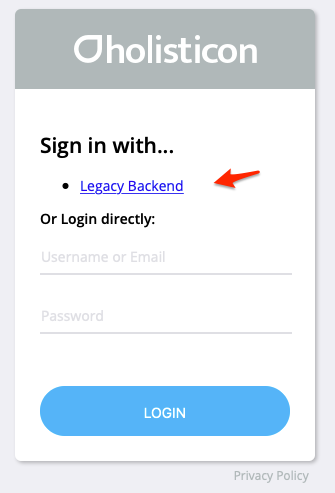
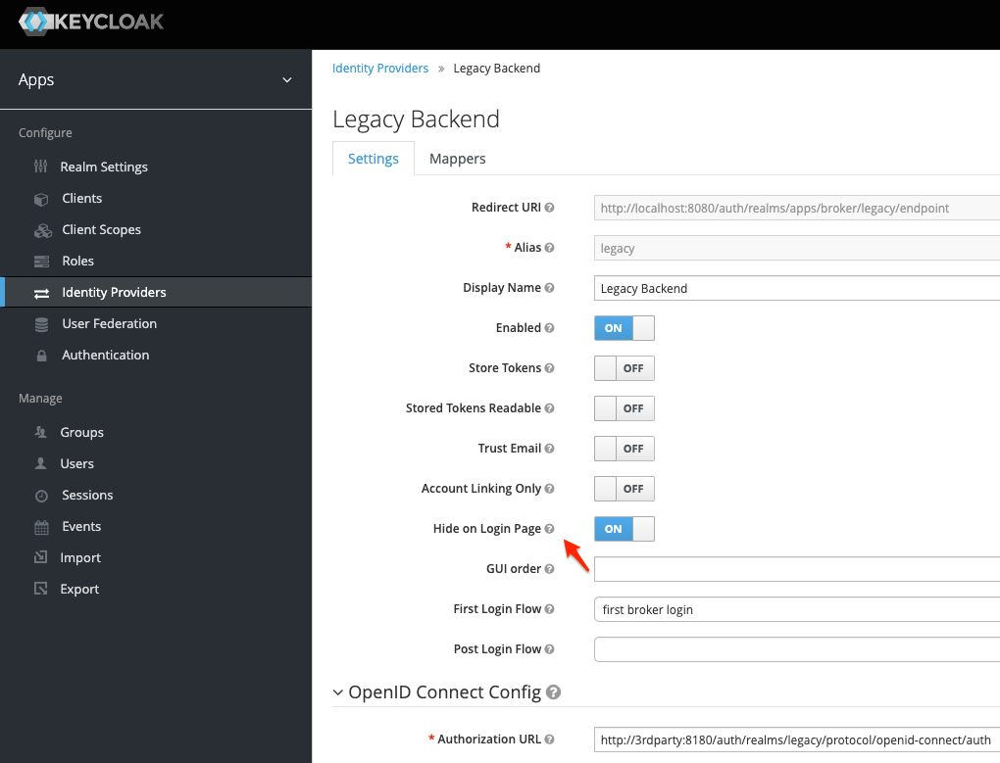
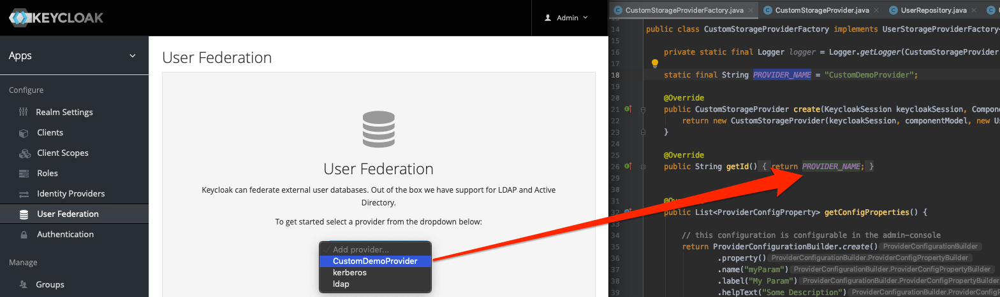
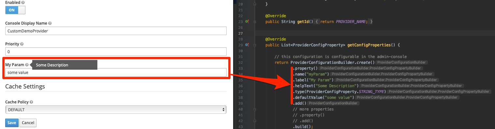

# Keycloak external Authenticator Demo
Show sample implementation for using external auth provider in keycloak

- [Keycloak external Authenticator Demo](#keycloak-external-authenticator-demo)
  - [Demo usage](#demo-usage)
    - [Users](#users)
    - [Federation Scenarios](#federation-scenarios)
      - [Use Legacy System as Authentication Provider](#use-legacy-system-as-authentication-provider)
      - [Use Legacy System as User Federation Provider](#use-legacy-system-as-user-federation-provider)
    - [Testing Keycloak e-mails](#testing-keycloak-e-mails)
  - [Deployment to Keycloak](#deployment-to-keycloak)

## Demo usage

Start setup of this demo:
```
./mvnw package
docker-compose up -d
...
```


Keycloak is available at [localhost:8080](http://localhost:8080/). Another Keycloak (acting as 3rd Party OAuth server) is available at [localhost:8180](http://localhost:8180/).

To create new setup sql dump:
```
./bin/dev-dump-sql-docker.sh 
```

### Users

* master Realm:
  * admin / admin
* Apps Realm (regular Keycloak)
  * user / user
* Legacy Realm (3rd Party Keycloak)
  * legacy / legacy 

### Federation Scenarios

#### Use Legacy System as Authentication Provider

To get the redirect working add a DNS alias, e.g. `/etc/hosts`:

```
# fake localhost with custom domain
127.0.0.1 3rdparty
```

Now the [login](http://localhost:8080/auth/realms/apps/account) is possible directly with one of the app user or by using one of the legacy user:



But it's only working when via frontend redirect. One possibility would be to hide the legacy login option and use `kc_idp_hint` as URL parameter:



But this would lead to having each frontend app know which is a legacy user.


#### Use Legacy System as User Federation Provider

Another option without any frontend redirect would be a [customer federation provder](https://www.keycloak.org/docs/latest/server_development/index.html#provider-interfaces):



It's also possible to add config options here:




The real implementation is done in `UserRepository.java`:
```
class UserRepository {

    private List<User> users;

    public UserRepository() {
        users = Arrays.asList(
                new User("42", "legacy", "legacy")
        );
    }

    public List<User> getAllUsers() {
        return users;
    }

    public int getUsersCount() {
        return users.size();
    }

    public User findUserById(String id) {
        return users.stream().filter(user -> user.getId().equals(id)).findFirst().get();
    }

    public User findUserByUsernameOrEmail(String username) {
        return users.stream()
                .filter(user -> user.getUsername().equalsIgnoreCase(username) || user.getEmail().equalsIgnoreCase(username))
                .findFirst().get();
    }

    public List<User> findUsers(String query) {
        return users.stream()
                .filter(user -> user.getUsername().contains(query) || user.getEmail().contains(query))
                .collect(Collectors.toList());
    }

    public boolean validateCredentials(String username, String password) {
        return findUserByUsernameOrEmail(username).getPassword().equals(password);
    }

    public boolean updateCredentials(String username, String password) {
        findUserByUsernameOrEmail(username).setPassword(password);
        return true;
    }

}
```

The benefit is that the user never sees any UI from the backend system.

>NOTE: Within the demo setup you can play around with the code and update the JAR via `./mvnw package` and Keycloak will redeploy the SPI after a few seconds. No need to restart 


### Testing Keycloak e-mails
The local Keycloak server includes MailDev, a mock SMTP server that you can use to receive and view Keycloak e-mails. It is available on <http://localhost:9999>.

To set up the local Keycloak server to send e-mails to MailDev:

1. Log in to [the local Keycloak server](http://localhost:8080).

2. Go to the “Email” tab in “Realm Settings”

3. Enter the following details:

    - Host: **maildev**

    - From: **keycloak@keycloak**

4. Click on “Save”

5. Click on “Admin” in the top-right-hand corner of the page, and click on “Manage Account”

6. Add an e-mail address to the admin account.

    It doesn’t matter what e-mail address you add, as all e-mails will be caught by MailDev. But you do need to add one, otherwise Keycloak will not send e-mails for this account.

The local Keycloak server should now be set up to send e-mails to MailDev. To check that it’s working:

1. Click on the “Back to Security Admin Console” link

2. Click on the “Login” tab in “Realm Settings”

3. Enable “Forgot password”, and click on “Save”

4. Sign out.

5. On the Keycloak log in screen, click on the “Forgot your password?” link

6. Enter your username (**admin**) in the text field, and submit the form.

7. Visit [MailDev](http://localhost:9999). You should see a reset password e-mail from Keycloak.


## Deployment to Keycloak

To use the custom provider in Keycloak just copy `src/provider/target/keycloak-custom-federation-0.1.0-SNAPSHOT.jar` to `/opt/jboss/keycloak/standalone/deployments/` or build a custom Docker Image:

```
FROM jboss/keycloak:7.0.1
...
ENV KEYCLOAK_DIRECTORY=/opt/jboss/keycloak/
...
COPY src/provider/target/*.jar ${KEYCLOAK_DIRECTORY}/standalone/deployments/
...
```